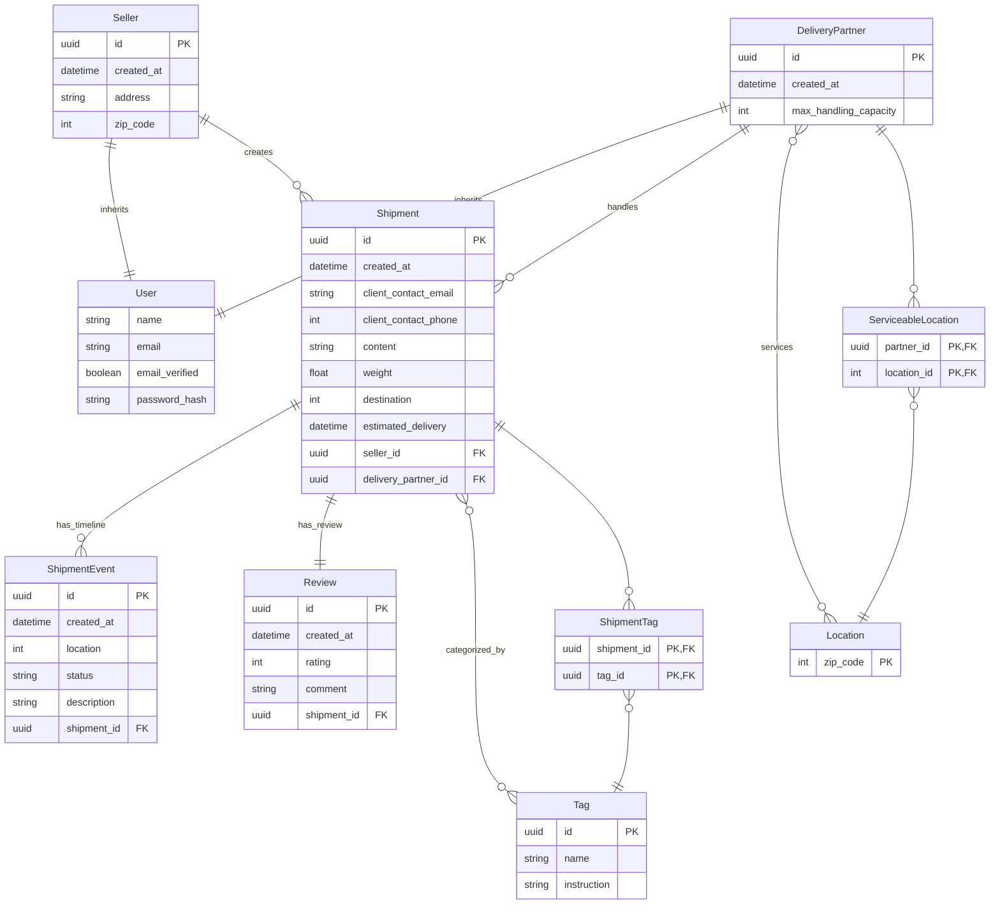
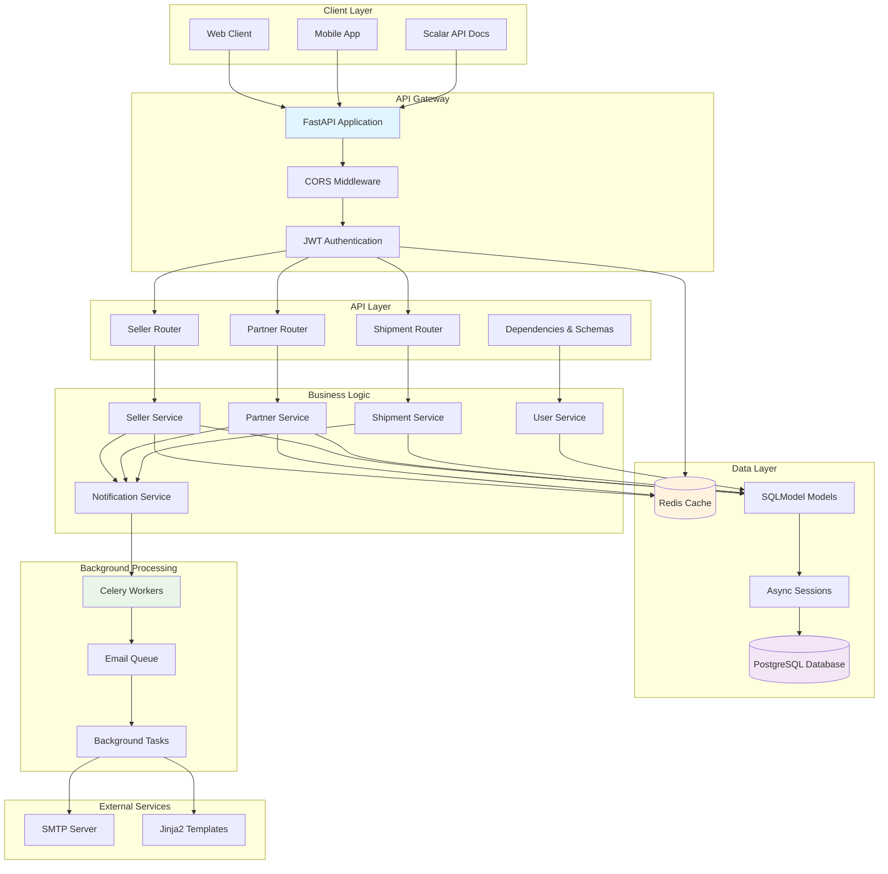
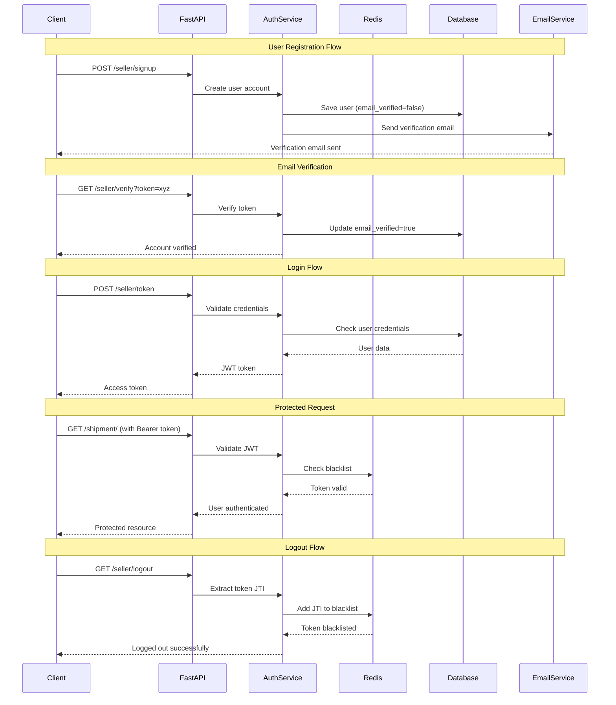
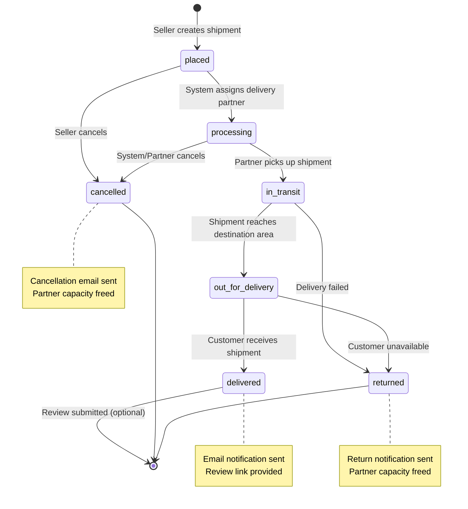
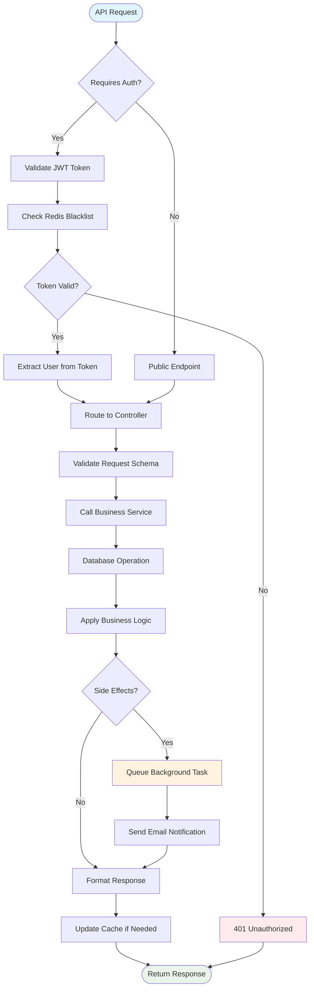
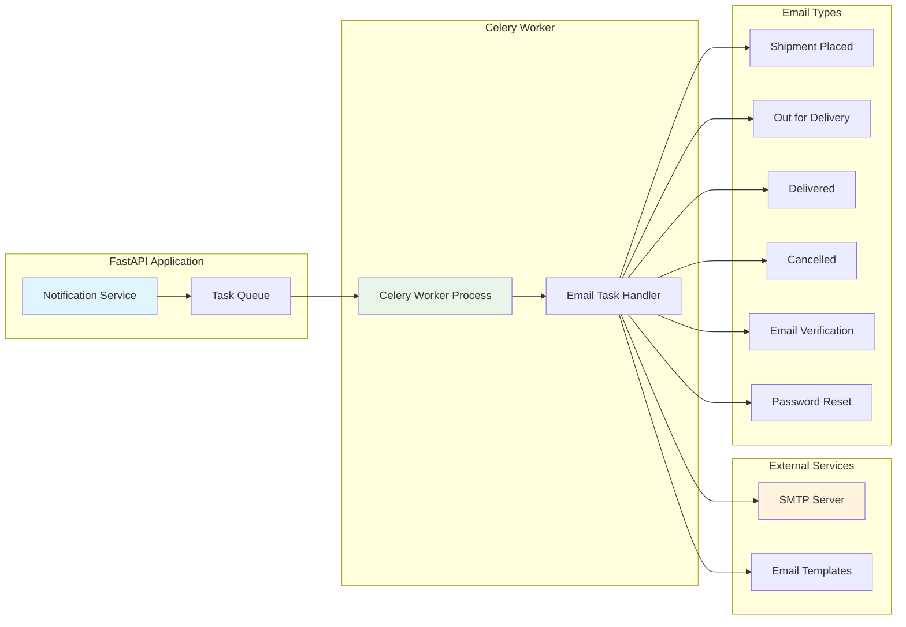
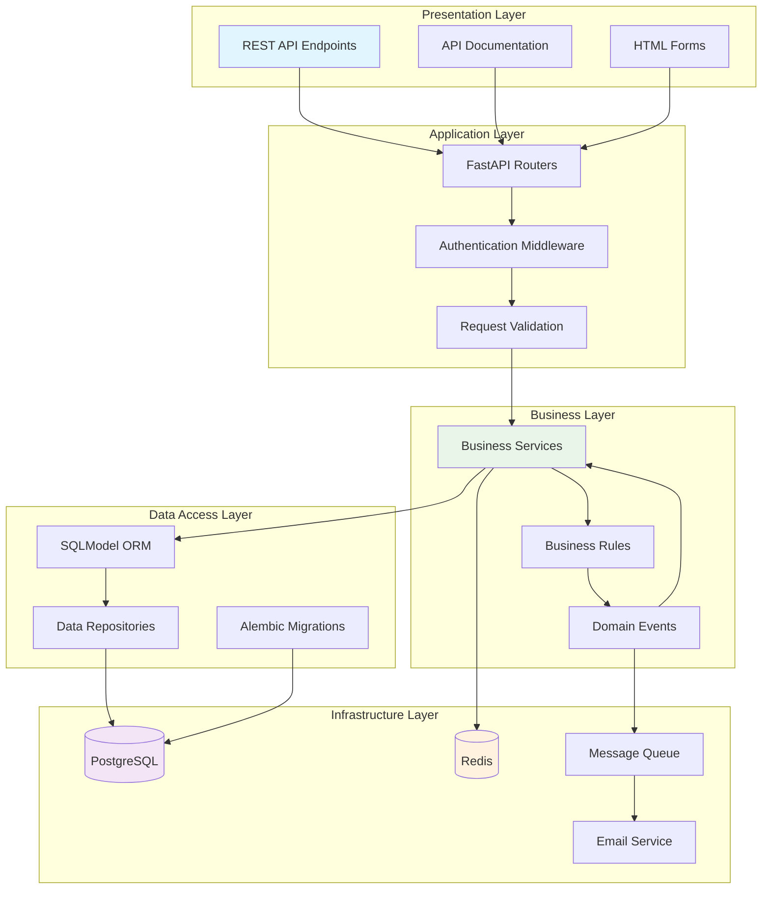

# FastShip Backend System Diagrams

This document contains comprehensive system diagrams for the FastShip delivery management backend.

## Database Schema

## System Architecture

## Authentication Flow

## Shipment Lifecycle

## API Request Flow

## Background Task Processing

## Data Flow Architecture

